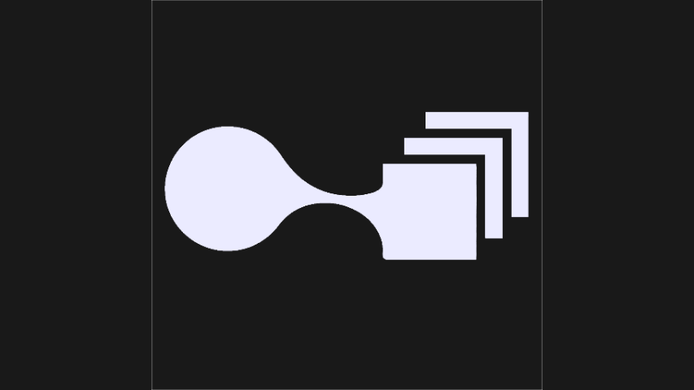

# TD-SOP-USD-Anim-Bridge

[](LICENSE)

TouchDesigner SOP animation to self-contained USD caches.

## Overview

Build procedural (or any) SOP animation in TouchDesigner and write it straight to USD - a single self-contained cache that every major 3D package reads, so you can render it in Blender, Houdini, or wherever you work. The drop-in component writes readable `.usda` out of the box, and compact `.usdc` after installing the optional usd-core sidecar.

## Features

- Animated `.usda` and `.usdc` export from a SOP input.
- Mesh and point output, including changing topology.
- Point, vertex, and primitive attributes, including custom attributes.
- Native TD Mesh primitive tessellation to polygon faces.
- Built-in mappings for normals, UVs, colors, ids, velocities, and extent.
- Half-precision export modes for smaller USD crate files.
- Playback-driven animated export for stateful SOP networks.
- Memory-bounded animated `.usda` streaming with a one-frame peak and cancel/progress.

## Requirements

- TouchDesigner (last tested on build 2025.32820).
- Windows or macOS for the component; `.usda` export has no extra Python package.
- Optional `usd-core` sidecar for `.usdc` export and validation.

## Installation

Drop `TD_SOP_USD_Anim_Bridge.tox` into a TouchDesigner project and wire a SOP into the component input. The component reads the input through its internal `IN_FOR_EXPORT` SOP and exposes all controls as custom parameters.

For repository development, open `TD-SOP-USD-Anim-Bridge.toe`; the extension source is tracked at `src/ExportExt.py` and synced into the component's `ExportExt` DAT.

## Binary Export Setup

`.usda` works immediately. `.usdc` and `tools/validate_usd.py` need usd-core:

```powershell
python tools/setup.py
```

Inside TouchDesigner, press `Setup Binary Support` on the component to run the same setup with TD's bundled Python. The setup needs internet access for `pip`.

Advanced override order for `.usdc` transcode:

1. `USD Python Executable` custom parameter.
2. `TD_SOP_USD_ANIM_BRIDGE_PYTHON` environment variable.
3. Bundled `tools/.venv-usd` created by setup.

## Usage

| Parameter | Purpose |
| --- | --- |
| `File` | Output path. Relative paths are anchored to `project.folder`. |
| `Format` | `usda` for direct ASCII, `usdc` for sidecar-transcoded crate. |
| `Export` | Run the export. |
| `Cancel` | Abort an active animated export and clean temporary files. |
| `Animate` | Export the frame range instead of the current frame. |
| `Output FPS` | FPS authored into animated USD metadata. Default expression follows the current TD timeline rate. |
| `Frame Step` | TD source-frame decimation. `1` writes every frame, `2` writes every second frame, etc. Playback still cooks every frame. |
| `Playback Start` | Timeline frame to start playback for pre-roll before writing. |
| `Frame Start` / `Frame End` | Inclusive animated export range. |
| `Progress` | Animated export progress from 0 to 1. |
| `Export Status` | Current animated export state or last result. |
| `Topology Changes` | Enable when point count or face topology can vary. |
| `Half Precision` | `Off`, `Safe Half`, or `All Half`. |
| `USD Python Executable` | Optional path to a `python.exe`/Python binary that has `usd-core` installed. Leave empty for the bundled sidecar. |
| `Binary Status` | Last setup status message. |
| `Setup Binary Support` | Installs/updates `tools/.venv-usd` for `.usdc`. |
| `Temp Folder` | Folder for setup logs, animated export chunks, and temporary `.usda` files. Default `_tdsopusd_temp`; relative paths are anchored to `project.folder`. |

When `Animate` is on, `Export` starts playback and returns immediately. Watch `Export Status` / `Progress`; the USD file is complete only after status becomes `Done`. Animated-only controls are disabled when `Animate` is off, and `Cancel` is enabled only while an animated export is running.

For a 60 FPS TouchDesigner simulation that should become a 30 FPS USD cache while preserving timing, set `Output FPS = 30` and `Frame Step = 2`. TD still plays every simulation frame; the exporter writes source frames `1, 3, 5...` as dense USD timeCodes `1, 2, 3...`.

## Output And Size

`.usda` stays readable and is useful for debugging. `.usdc` is much smaller and better for production transfer, but the sidecar transcode materializes the full layer in RAM.

`Half Precision` trades file size for accuracy: `Safe Half` shrinks the file by halving attributes where 16-bit loss is hard to see (normals, UVs, colors, velocities), while `All Half` shrinks it further by also halving point positions and widths - visible as jitter or banding on large or fine geometry. Pick `Safe Half` as a default and reach for `All Half` only when size matters more than positional precision.

Animated export chunks, setup logs, and temporary `.usda` files are written under the `Temp Folder` parameter (`_tdsopusd_temp/` by default) and removed on normal completion/cancel/failure.

## Limitations

- NURBS and Bezier input need a Convert SOP first.
- `.usdc` transcode is not memory-bounded, unlike the TD-side `.usda` writer.
- A SOP containing loose points plus faces currently exports one mesh; multi-prim
  output is a known gap.

## Project Structure

- `TD_SOP_USD_Anim_Bridge.tox` - distributable component.
- `TD-SOP-USD-Anim-Bridge.toe` - development TouchDesigner project.
- `src/ExportExt.py` - canonical extension source synced to the DAT.
- `tools/` - setup, validation, and `.usdc` transcode helpers.
- `docs/adr/` - architecture decisions.
- `docs/changelog.md` - shipped changes.

## Development

Edit `src/ExportExt.py`, reload/sync the `ExportExt` DAT, save the `.toe`, and export a fresh `.tox` when component behavior changes. Validate exported USD with:

```powershell
tools/.venv-usd/Scripts/python.exe tools/validate_usd.py export/sop_usd_export.usda
```

## License

MIT, see [LICENSE](LICENSE).
